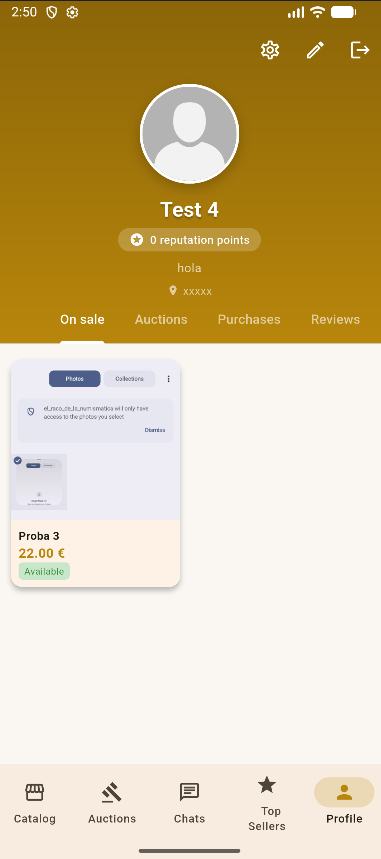

# El Racó de la Numismàtica 🪙

Aplicació mòbil per a col·leccionistes de monedes desenvolupada amb Flutter i Firebase. Permet la compravenda, subasta i gestió de col·leccions numismàtiques.

## 👥 Integrants del Projecte
- Alex Moix Cabezudo

## 🚀 Requisits Complerts
L'aplicació compleix amb els següents requisits del projecte:

### 1. Tecnologia
- **Frontend:** Flutter (Dart).
- **Backend:** Firebase (Firestore, Authentication, Storage).
- **Multiplataforma:** Optimitat per a Android.

### 2. Arquitectura i Qualitat
- **Estructura per capes:** Separació clara entre UI, lògica de negoci i dades.
- **Models:** Ús de models amb mapatge `fromJson`/`toJson`.
- **Gestió d'estat:** Implementada amb el paquet `Provider`.

### 3. Funcionalitats (CRUD i més)
- **Autenticació:** Login, registre i persistència de sessió amb Firebase Auth.
- **CRUD Complet:** Creació, lectura, actualització i eliminació de monedes.
- **Consultes:** Llistats amb filtres de cerca i ordenació.
- **Navegació:** Més de 4 pantalles (Inici, Detall, Crear, Perfil, Subastes, Carret).
- **Temes:** Suport complet per a Mode Clar i Mode Fosc.

### 4. Seguretat i UX
- **Validació:** Formularis amb validació de dades.
- **Gestió d'errors:** Ús de SnackBars i Diàlegs per informar l'usuari.
- **Accessibilitat:** Textos escalables i components accessibles segons estàndards de Material 3.

## 📸 Captures de Pantalla

| Mode Clar | Mode Fosc |
| :---: | :---: |
|  |  |

## 🛠️ Instruccions de Compilació i Execució

### Requisits previs
- Flutter SDK (^3.9.0)
- Android Studio / VS Code
- Dispositiu Android o Emulador

### Passos
1. Clonar el repositori:
   ```bash
   git clone [URL_DEL_REPOSITORI]
   ```
2. Instal·lar dependències:
   ```bash
   flutter pub get
   ```
3. Configurar Firebase:
   - Descarregar `google-services.json` des de la consola de Firebase i posar-lo a `android/app/`.
4. Executar l'aplicació:
   ```bash
   flutter run
   ```

### Generar APK
Per generar el fitxer executable per a Android:
```bash
flutter build apk --release
```

## 📂 Documentació Addicional
Podeu trobar documentació més detallada a la carpeta `documentacio`:


