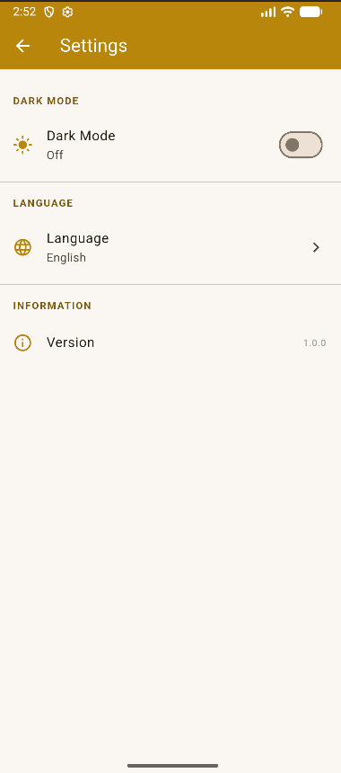
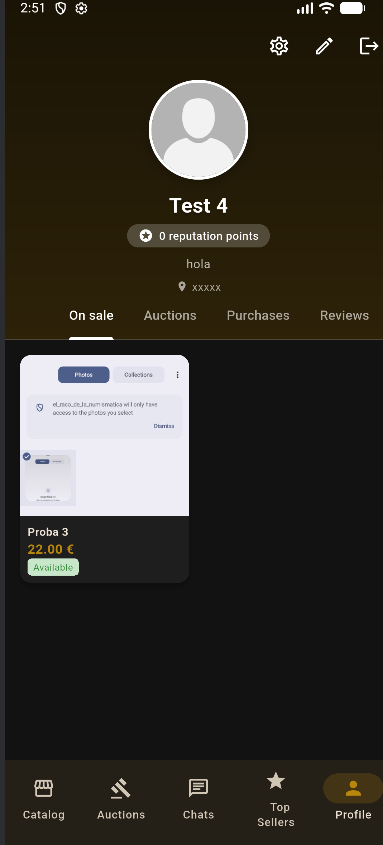

# Document de Disseny - El Racó de la Numismàtica

## 1. Descripció del Projecte
**El Racó de la Numismàtica** és una aplicació mòbil multiplataforma (centrada en Android) dissenyada per a col·leccionistes de monedes. Permet als usuaris gestionar la seva col·lecció, posar monedes a la venda o en subasta, i interactuar amb altres usuaris mitjançant un sistema de xat i ressenyes.

## 2. Integrants del Projecte
- Alex Moix Cabezudo

## 3. Tecnologia i Stack Tècnic
- **Frontend:** Flutter (Dart).
- **Backend/BBDD:** Firebase Cloud Firestore.
- **Autenticació:** Firebase Authentication (Email/Password).
- **Emmagatzematge d'Imatges:** Cloudinary / Firebase Storage.
- **Gestió d'Estat:** Provider.
- **Navegació:** GoRouter.

## 4. Arquitectura de l'Aplicació
L'aplicació segueix una estructura de capes per garantir la separació de responsabilitats:

- **Capa de Dades (`lib/models`):** Defineix les entitats del sistema (Usuari, Moneda, Puja, Pedido, etc.) amb mètodes `fromJson` i `toJson` per a la comunicació amb Firestore.
- **Capa de Lògica/Serveis (`lib/services`):** Conté la lògica d'accés a Firebase i altres APIs externes.
- **Capa de Gestió d'Estat (`lib/providers`):** Gestiona l'estat global de l'aplicació (Autenticació, Carret, Ajustos de Tema).
- **Capa d'Interfície d'Usuari (`lib/screens` & `lib/widgets`):** Pantalles i components visuals de l'app.

## 5. Model de Dades (Firestore)
Les col·leccions principals a Firestore són:
- **usuarios:** Dades de perfil, valoracions i rol.
- **monedas_venta:** Monedes disponibles per a compra directa.
- **monedas_subasta:** Monedes en procés de subasta.
- **pedidos:** Historial de compres realitzades.
- **chats/mensajes:** Sistema de missatgeria entre compradors i venedors.
- **resenas:** Valoracions entre usuaris.

## 6. Seguretat (Firebase Rules)
S'han implementat regles de seguretat a Firestore per assegurar que:
- Només els usuaris autenticats poden escriure dades.
- Un usuari només pot modificar el seu propi perfil.
- Les dades sensibles (com configuracions privades) no són d'accés públic.

## 7. Interfície i UX
L'aplicació implementa:
- **Mode Clar i Fosc:** Configurable des de l'apartat de perfil.
- **Accessibilitat:** Ús de components estàndard de Material 3, textos escalables i contrastos adequats.
- **Disseny Adaptatiu:** L'app està preparada per escalar els seus elements segons la densitat de la pantalla.

## 8. Captures del Disseny

### Mode Clar

### Mode Fosc

