# Manual d'Usuari - El Racó de la Numismàtica

## 1. Introducció
Benvingut a **El Racó de la Numismàtica**, la teva aplicació de confiança per a la compravenda i subasta de monedes de col·lecció. Aquest manual t'ajudarà a fer els primers passos i a treure el màxim profit de totes les funcionalitats.

## 2. Accés i Registre
Per utilitzar l'aplicació, cal estar registrat:
1. **Registre:** Prem a "Registra't" a la pantalla inicial. Introdueix el teu correu, contrasenya i nom d'usuari.
2. **Login:** Si ja tens un compte, introdueix les teves credencials. L'aplicació recordarà la teva sessió per a futures visites.
3. **Logout:** Pots tancar la sessió en qualsevol moment des de la teva pantalla de perfil.

## 3. Navegació Principal
L'aplicació es divideix en quatre seccions principals accessibles des de la barra inferior:
- **Inici (Llistat):** On podràs veure totes les monedes disponibles. Pots filtrar per nom o categoria i ordenar per preu o data.
- **Subastes:** Secció dedicada exclusivament a les monedes que estan en procés de subasta.
- **Vendre:** Pantalla on podràs crear un nou anunci per a la teva moneda (venda directa o subasta).
- **Perfil:** On podràs gestionar les teves dades, veure les teves compres i canviar la configuració de l'app.

## 4. Gestió de Monedes (CRUD)
- **Crear:** Prem el botó "+" o la secció "Vendre" per pujar una nova moneda. Cal omplir el títol, descripció, preu i pujar una imatge.
- **Llegir:** Prem sobre qualsevol moneda del llistat per veure'n els detalls complets, fotos i informació del venedor.
- **Editar/Eliminar:** Des del teu perfil, podràs veure els teus anuncis publicats i modificar-los o eliminar-los si ja no estan disponibles.

## 5. Compra i Subasta
- **Compra Directa:** Afegeix les monedes al carret i finalitza la compra des de la icona de la bossa.
- **Pujar en Subasta:** Entra en una moneda de subasta i introdueix la teva puja. El sistema t'avisarà si la teva és la més alta.

## 6. Configuració i Personalització
Pots canviar l'aparença de l'aplicació des de la pantalla de perfil:
- **Tema Clar/Fosc:** Tria entre el mode clar, fosc o el predefinit pel sistema.
- **Idioma:** L'app s'adapta a l'idioma configurat al teu dispositiu.

## 7. Resolució de Problemes
Si experimentes algun error (com problemes de connexió o errors al pujar imatges), l'aplicació et mostrarà un missatge informatiu (SnackBar) a la part inferior de la pantalla amb els passos a seguir.

## 8. Guia de usuari amb Captures

Aquí teniu un conjunt de captures per facilitar la comprensió de l'aplicació:

Al entrar et trobarasamb el loguin o pdras anar a registrar-te si no tens un compte.
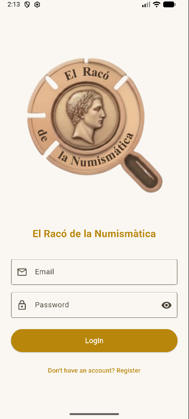
Des de el login podràs accedir al cataleg, subastas, vendre o al teu perfil.
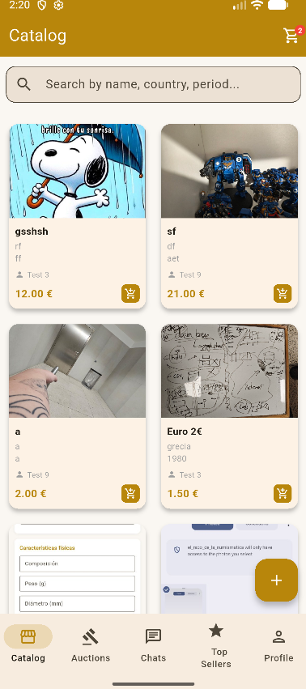
A cataleg podras anar a crear un anunci de venda directament, amb la moneda i el preu desitjat
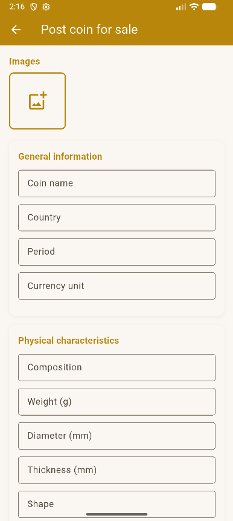
Despres si seleciones un producte podras anar al carret de la compra per comprar el producte
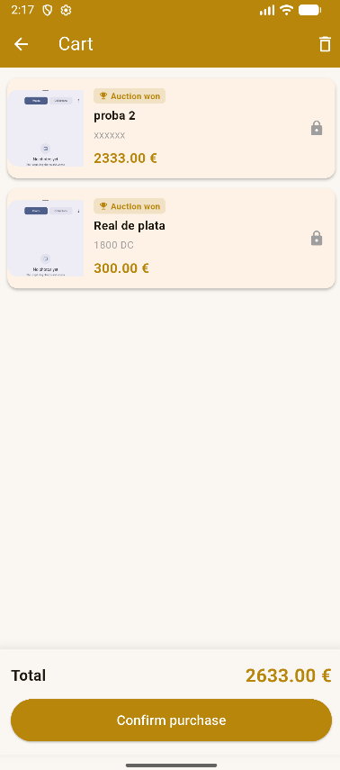
En pagina de subastas podras anar a veure les subastas que hi han
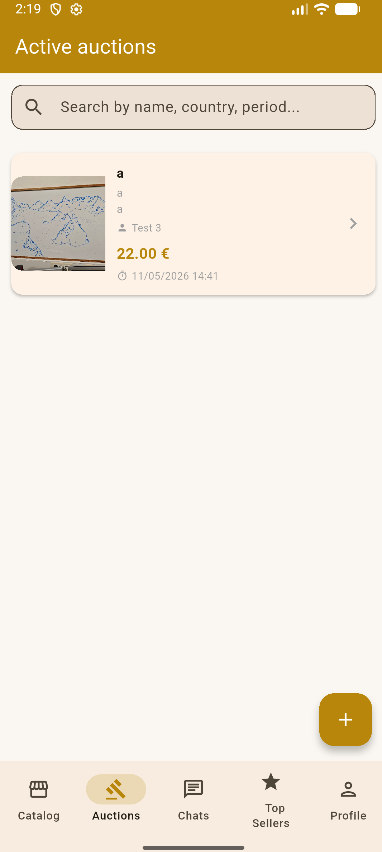
Desde la pagina de subasta podras anar a crear una subasta
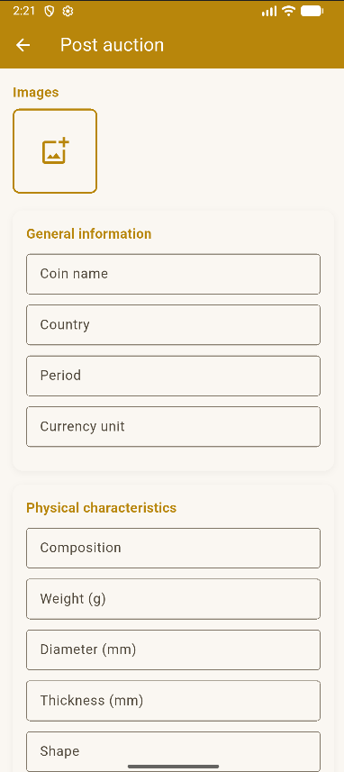
En pagina de chats podràs anar a veure els chats que hi han
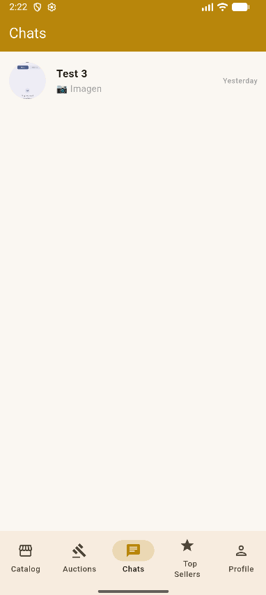
Dintre de un chat podras veure els missatges entre el comprador i el venedor
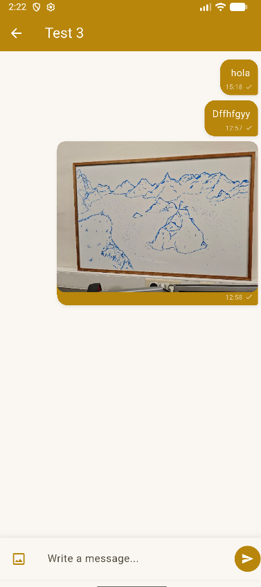
Aqui podras veure els venedos ordenats per les millors valoracions
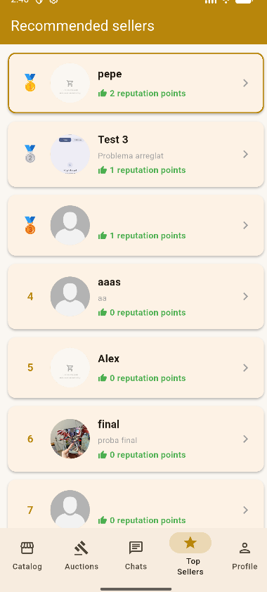
Entran en perfil podràs veure els teus anuncis i compres i resenyes
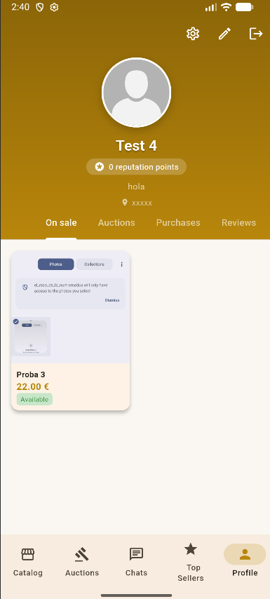
En la pagina de opcions podràs canviar el tema, idioma i tancar sessió.
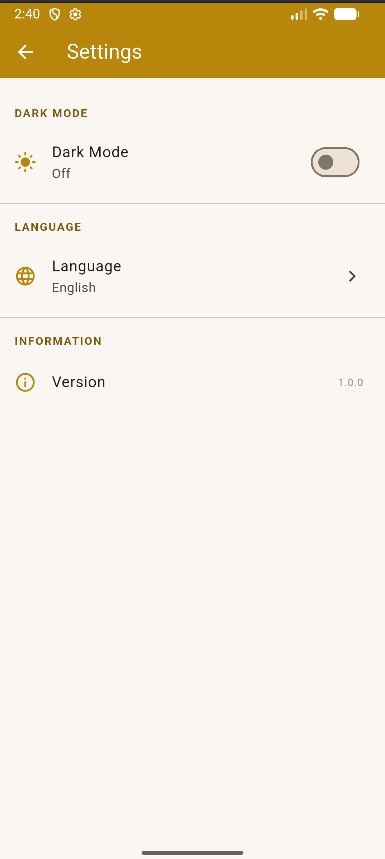
I en la pagina de editar perfil podràs editar el teu perfil, on veuràs el teu nom, la teva contrasenya i la teva biografia
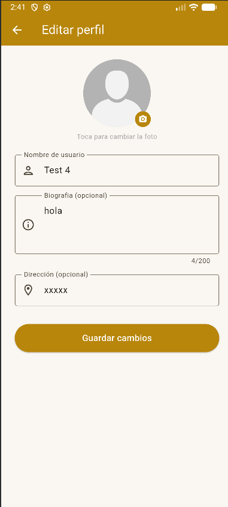
